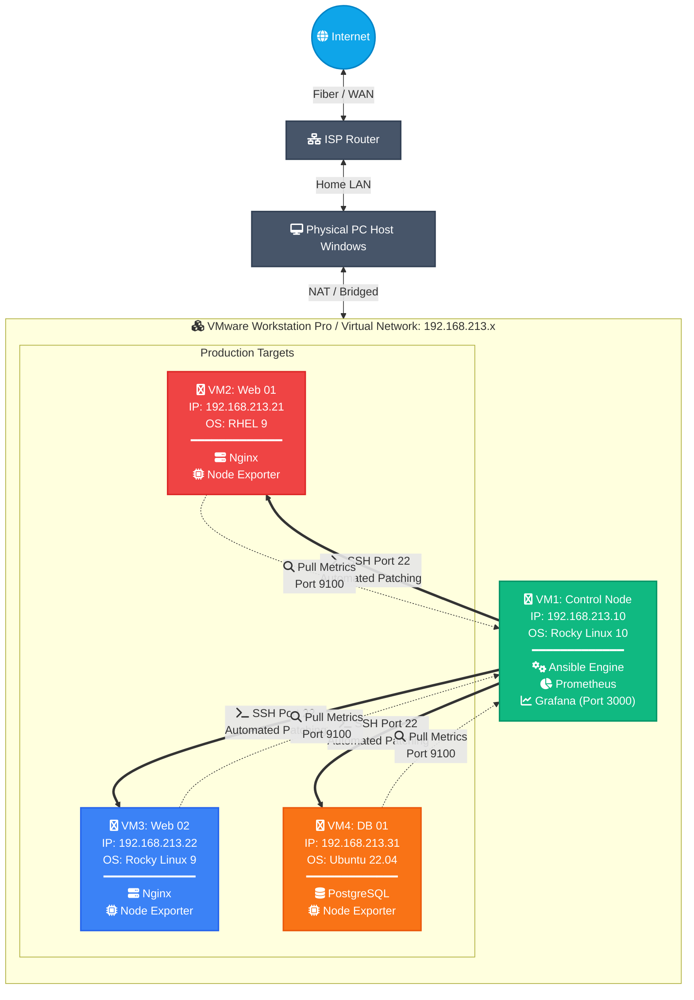

# Linux Homelab Sandbox: Automated Patching with Ansible & Prometheus/Grafana Monitoring




## 📌 Project Overview
This is a personal, self-hosted homelab environment built to experiment with multi-distribution Linux systems administration, configuration management, and infrastructure observability. 

The goal of this project was to move away from manual server maintenance and simulate a real-world scenario: managing a small web and database cluster across different Linux families (RedHat & Debian), automating routine security patching windows safely, and visualizing the infrastructure health using an open-source monitoring stack.

## 🚀 What I Practiced & Implemented
- **Multi-OS Administration**: Handled a mixed environment of RHEL, Rocky Linux, and Ubuntu Server, managing the fundamental differences in network configurations, user permissions, and package managers (DNF vs. APT).
- **Automated Rolling Updates**: Wrote an Ansible Playbook using the `serial: 1` parameter to update the web servers one by one. This simulates a high-availability upgrade where services remain online for users while maintenance is performed.
- **Dynamic Report Generation**: Programmed a custom **Jinja2** template within the Ansible pipeline to automatically capture update results and output a text-based patch summary report locally on the control node.
- **Full-Stack Monitoring**: Manually installed and configured **Prometheus** and **Grafana**, and deployed `node_exporter` across all virtual machines to collect and visualize real-time CPU, RAM, disk, and network metrics.

## 🏗️ Homelab Topology & Inventory
This infrastructure is fully virtualized using a local hypervisor ecosystem.

- **VM1 (Control Node)**: `192.168.213.10` (Rocky Linux 10 / Ansible Core / Prometheus / Grafana)
- **VM2 (Web Server 01)**: `192.168.213.21` (RHEL 9.3 / Nginx)
- **VM3 (Web Server 02)**: `192.168.213.22` (Rocky Linux 9 / Nginx)
- **VM4 (Database Server)**: `192.168.213.31` (Ubuntu Server 22.04 / PostgreSQL)

```text
[Control Node (VM1)] --(SSH/Port 22: Ansible Command)--> [Target VMs (VM2, VM3, VM4)]
[Control Node (VM1)] <--(Metrics/Port 9100: Pull Data)-- [Node Exporters on Targets]
```

## 📁 Repository Structure
```text
ansible-patch-project/
├── ansible.cfg          # SSH and inventory behaviors configuration
├── inventory.ini        # Defined host groups and global variables (ansible_user)
├── setup_services.yml   # Playbook for initial baseline setup (Nginx & PostgreSQL)
├── patch_pipeline.yml   # Rolling patching workflow with conditional reboots
└── report.j2            # Jinja2 template for generating local patch summaries
```

## 🛠️ How I Run the Lab

### 1. Initialize the Base Services
To set up the initial web servers and database instances across the hosts:
```bash
ansible-playbook setup_services.yml -K
```

### 2. Run the Patching & Reporting Pipeline
To check for security updates, apply them sequentially, reboot the nodes safely if needed, and compile the patch status report:
```bash
ansible-playbook patch_pipeline.yml -K
```

## 📄 Sample Generated Report (`patch_report_192.168.213.21.txt`)
Every time the patching pipeline runs, it dynamically aggregates host statistics into a clean text summary file on the control node:

```text
========================================================================
                    ENTERPRISE PATCH MANAGEMENT AUDIT REPORT
========================================================================
Host IP Address   : 192.168.213.21
OS Distribution   : RedHat 9.3
Execution Time    : 2026-06-15 16:52:10
Patch Status      : SUCCESS_UPDATED
Reboot Triggered  : YES

[Audit Details]
- Action Taken: Security patching pipeline executed successfully.
- Result: Operating system packages have been upgraded to the latest baseline.
- Post-Action: System reboot completed to apply new kernel updates and libraries.
========================================================================
```
